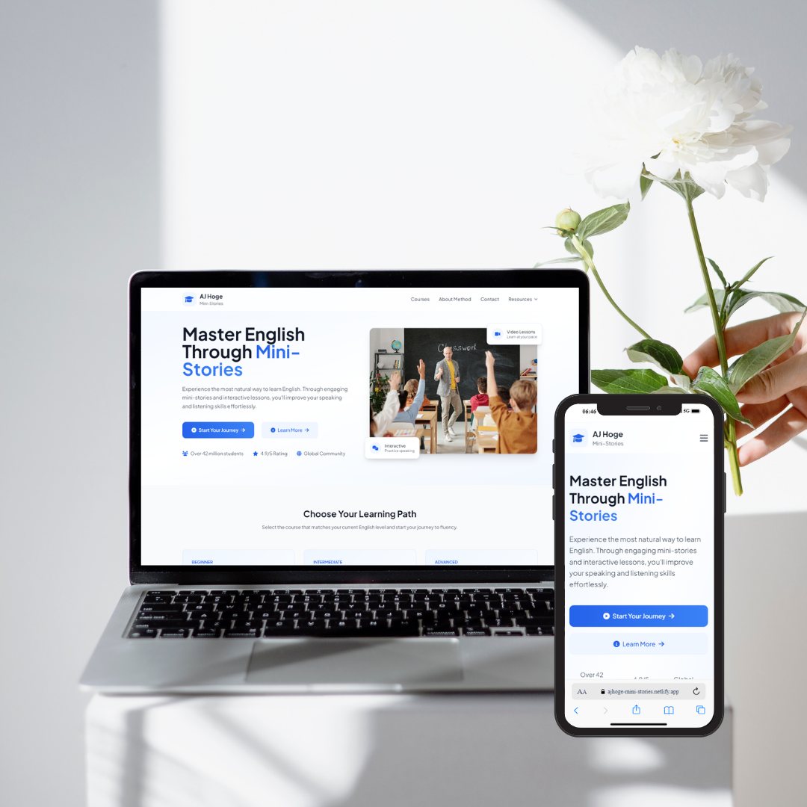

# AJ Hoge Mini-Story Hub 🌟

A modern, interactive website for learning English through AJ Hoge's revolutionary mini-story method. Built with HTML, Tailwind CSS, and JavaScript.



<div align="center">
  
### 🚀 [Try the Live Demo](https://ajhoge-mini-stories.netlify.app/)

**Love this project? Consider supporting its development!**

<a href="https://www.buymeacoffee.com/onlymar" target="_blank">
  
</a>

</div>


## 🚀 Features

- **Interactive Learning Experience**
  - Video-based lessons
  - Mini-story methodology
  - Progress tracking system
  - Responsive design for all devices

- **Course Levels**
  - 🌱 Beginner Course
  - 🌿 Intermediate Course
  - 🌳 Advanced Course

- **Modern UI/UX**
  - Clean and professional design
  - Smooth animations
  - Intuitive navigation
  - Mobile-first approach

## 💻 Technology Stack

- HTML5
- Tailwind CSS
- JavaScript
- Font Awesome Icons
- YouTube API Integration

## 📚 Course Structure

Each level (Beginner, Intermediate, Advanced) includes:
- Curated video lessons
- Interactive mini-stories
- Progress tracking
- Natural learning approach

## 🌟 Why Choose This Course?

- **Natural Learning Method**: Learn English the same way children learn their native language
- **Interactive Stories**: Engage with interesting content that makes learning fun and effective
- **Track Your Progress**: Monitor your improvement with our built-in progress tracking system
- **Global Community**: Join over 42 million students worldwide
- **Expert Method**: Based on AJ Hoge's proven teaching methodology

## 🔧 Installation & Setup

1. Clone the repository:
   ```bash
   git clone https://github.com/omaralhami/English-Course-Website.git
   ```

2. Open `index.html` in your browser

3. Start learning English naturally! 🎉

## 📱 Responsive Design

The website is fully responsive and works seamlessly on:
- 📱 Mobile devices
- 💻 Tablets
- 🖥️ Desktop computers

## 📞 Contact

Have questions? Reach out to us:
- Email: omar.alhami@outlook.com

## 📄 License

This project is licensed under the MIT License - see the [LICENSE](LICENSE) file for details.

---

Made with ❤️ by Omar Alhami
